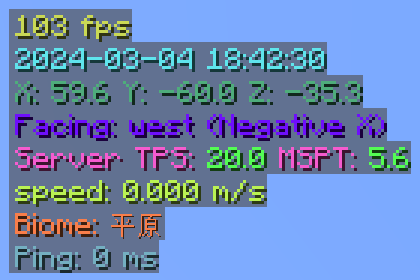
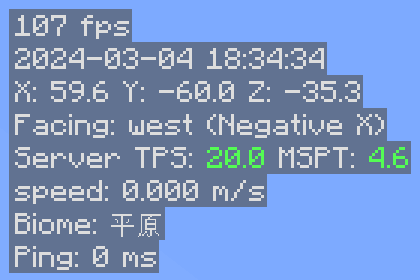

[English](./README_EN.md)

# MiniHUD Extra

  
  
  

### 概述
本模组为 [MiniHUD](https://www.curseforge.com/minecraft/mc-mods/minihud) (Fabric) 或 [BoccHUD](https://modrinth.com/mod/bocchud) (Forge) 添加了一些功能。 
在游戏中按下 Z + C 打开模组配置。
#### 功能
- **修改颜色**：为 MiniHUD 的每一行文本都添加可配置的颜色，而不是整个 HUD 的文本都只能是一种颜色。
- **[FTB Ultimine](https://www.curseforge.com/minecraft/mc-mods/ftb-ultimine-fabric) 支持**：当 FTB Ultimine 激活时，自动禁用 MiniHUD，防止两个 HUD 的重叠。如果你和我一样只习惯 HUD 在左上角的话。
- **MiniHUD 支持翻译**：为 MiniHUD 显示的文本添加本地化支持。仅限 Forge，Fabric 请使用 [Masa Gadget](https://modrinth.com/mod/masa-gadget/)。

### 画廊
  

### 编译
- 克隆本仓库。
- 打开命令行并定位到仓库目录。
- 运行 `gradlew build` 来编译模组。
- 编译好的模组生成在 `forge/build/libs` 和 `fabric/build/libs`。